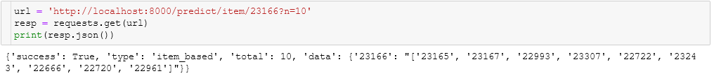
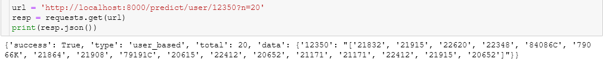
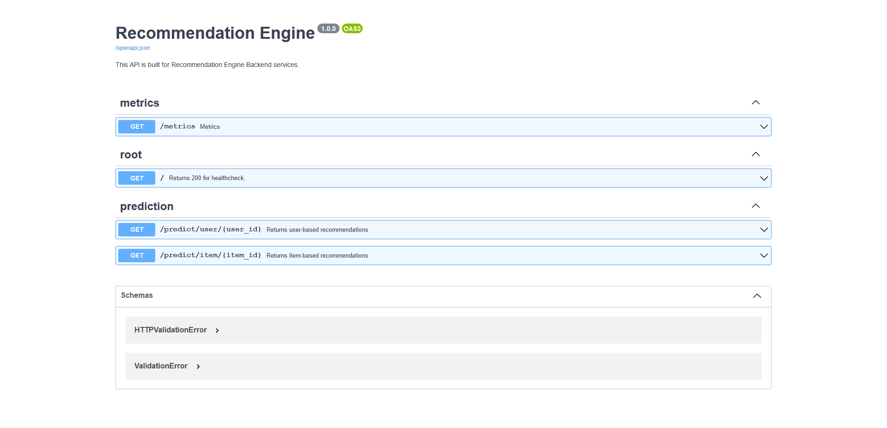
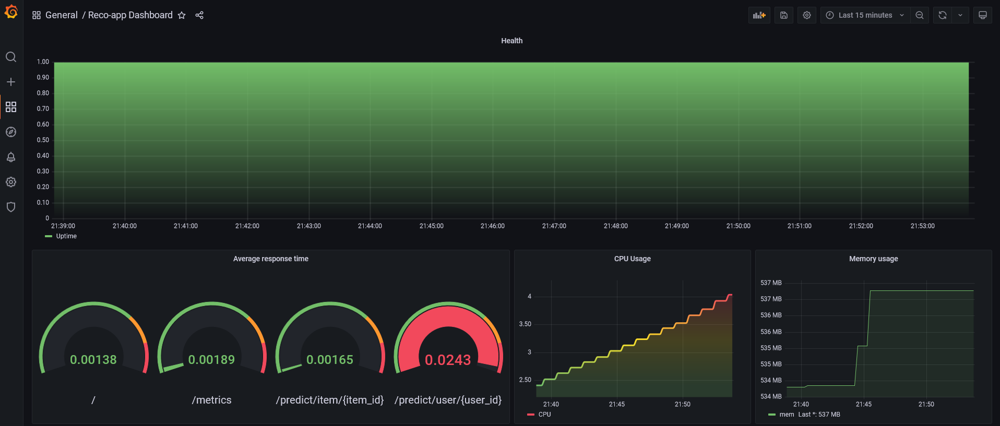
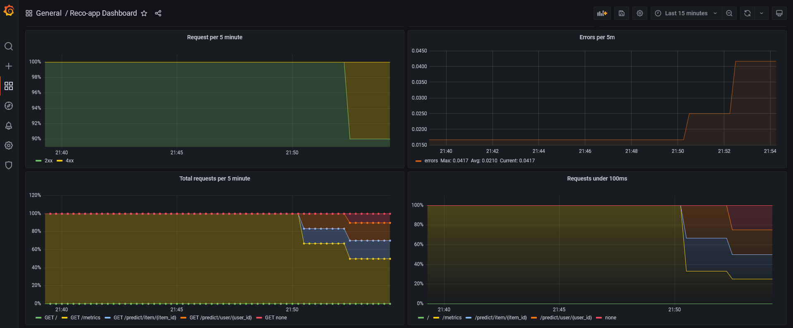

# SystemMonitoring
FastAPI-based project integrating Prometheus and Grafana for monitoring and enhanced with AI-driven recommendation capabilities.

# FastAPI + promethues + Grafana

<p style="text-align:center">
 

<!--  -->


</p>
<br>


## Installation

There are only two prerequisites Docker and Docker-compose: 

* [Docker](https://docs.docker.com/get-docker/)
* [Docker-compose](https://docs.docker.com/compose/install/)

<br>

``` bash
git clone https://github.com/AryanSharma9917/SystemMonitoring.git
```

## Usage

### Start 

``` bash
docker-compose up -d
```

If you make any changes you can add `--build`. 

``` bash
docker-compose up --build -d
``` 

### Stopping containers

``` bash
docker-compose down
```

### Container Logs
When running containers with detached mode (`-d`) they work in the background thus you can't see the flowing logs. If you want to check compose logs with cli you can use `logs`.

``` bash
docker-compose logs --tail 50
```

* FastAPI: http://localhost:8000
* Prometheus: http://localhost:9090
* Grafana: http://localhost:3000


# Changelogs
* Docker Image (Python to Python Slim)
* `requirements.txt`
    * scikit-learn & pandas
* `docker-compose.yaml`
    * Changed folder structure for Grafana provisioning
    * Change dashboard metrics & graphs
* Added data folder and `data_create.py`
* Added a touch of AI
    * Created user similarity and item similarity matrices

<br>

Docker Image
``` bash
https://hub.docker.com/r/aryansharma04/systemmonitoring
```

<br>

# Screenshots :
## API
<p align="center">
  
  
  
</p>

## Grafana
<p align="center">
  
  

</p>
